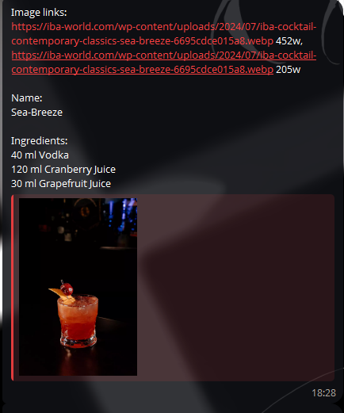

### About: 
Telegram bot to study cocktails. Every day at 12 o'clock, the bot sends a telegram message with the name and recipe of the cocktail from the site of the international association of bartenders

### Language and libraries:

* Python 
* BeautifulSoup 
* Requests 

### Desktop preview:

 

### Mobile preview:

---

  
   
  
  

